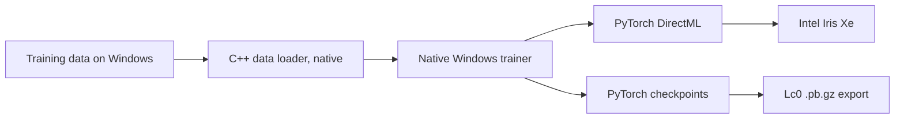

# Native Windows DirectML Training Port

## Goal

Port the JAX/Flax training pipeline to a native Windows PyTorch backend so an
Intel Iris Xe integrated GPU can train the KDA-hybrid network through
DirectML.

This is specifically a native Windows port. Intel Iris Xe cannot currently run
this trainer through JAX in WSL:

- JAX does not support Intel GPUs under WSL.
- Intel Extension for OpenXLA targets different JAX versions and primarily
  data-center Intel GPUs.
- OpenVINO can execute JAX-derived inference graphs but is not a JAX training
  backend.
- IREE's experimental Vulkan PJRT backend has no usable Vulkan/DRM device in
  this WSL environment.
- `torch-directml` has a known Iris Xe allocator failure under WSL. The same
  DirectML runtime works on this machine when run natively on Windows.

## Proven DirectML Behavior

Native Windows testing on `Intel(R) Iris(R) Xe Graphics` confirmed:

- Device discovery and allocation work.
- Elementwise forward and backward work.
- Matrix multiplication backward works.
- Softplus, exponential, cumulative sum, batched matrix multiplication, and
  depthwise-convolution backward work.
- A batched KDA recurrence matches an independent NumPy reference and has
  finite gradients on DirectML.

The following DirectML defects require explicit workarounds:

- Built-in PyTorch layer-normalization backward fails with
  `tensor does not have a device`. Implement layer normalization from mean,
  variance, `rsqrt`, scale, and bias instead.
- `torch.eye(..., device=directml_device)` follows a broken fallback path.
  Construct identity matrices from `ones` and `diag` instead.
- A zero-width `torch.nn.functional.pad` produces incorrect KDA results at
  chunk boundaries. Skip the pad call when the requested width is zero.
- `torch.flip` with a **negative** `dim` hard-crashes the process with an
  access violation (`0xC0000005`); the same call with the equivalent
  positive `dim` is correct. Normalize the axis before every flip.
- `torch.cumsum` inherits that defect through its gradient, which is a
  reverse cumulative sum implemented by flipping along the dim recorded
  during the forward pass. `cumsum(dim=-1)` therefore survives the forward
  pass and crashes in backward, far from its cause. Normalize the axis at
  the call site. No other axis-taking operator tested is affected: `sum`,
  `mean`, `softmax`, `cat`, `stack`, `transpose`, `squeeze`, `unsqueeze`,
  `max`, and cumsum's own forward pass all handle negative dims correctly.
- `torch_directml` must be imported **before the process runs its first
  backward pass**. The autograd engine sizes its per-device ready queues on
  first use, and PrivateUse1 is only counted if the module is already
  imported; otherwise every later DirectML backward fails with
  `0 <= device.index() && device.index() < device_ready_queues_.size()
  INTERNAL ASSERT FAILED at torch/csrc/autograd/engine.cpp:1451`. The
  trigger is the import, not touching a device -- a single CPU-only
  backward beforehand is enough to poison the process.
- `aten::index_add.out` is unimplemented, so the gradient of
  `torch.index_select` silently falls back to the CPU, copying the tensor
  off and back on every backward pass. Two cases matter, and neither needs
  the fallback: when the index is a permutation (every KDA board traversal)
  the scatter-add is a gather by the inverse permutation
  (`layers.permute_along`); when it merely has no repeats (the 1858-of-4288
  policy map) the gradient still never accumulates, so appending one zero
  slot turns the scatter into a gather too (`layers.injective_gather`).
- `aten::huber_loss` is unimplemented and falls back to the CPU, so the
  moves-left loss would copy off and back on **every training step**.
  Composed from `abs`/`where`/`square` instead (`losses._huber`). Worth
  re-checking after any new loss is added: the fallback is a warning, not an
  error, so it costs throughput silently. Grep a run's log for
  "not currently supported on the DML backend" -- a healthy step logs none.
- A **reflected** arithmetic operator against a Python scalar promotes the
  scalar to float64 and dies with "The GPU device does not support Double
  (Float64) operations!". `1.0 - tensor` fails; `tensor - 1.0`,
  `tensor + 1.0` and `1.0 + tensor` are all fine. Write the tensor on the
  left, or use `torch.ones_like`. This surfaced in the WDL target
  computation, `(1 - q - d) / 2`.

Every workaround above is implemented once in
`src/lczero_training/directml/layers.py`; prefer those helpers over the
torch built-ins throughout the port. They are ordinary PyTorch on CPU, so
nothing is lost by using them unconditionally.

The complete KDA mixer is in `src/lczero_training/directml/kda.py`, with
tests in `src/lczero_training/directml/test_kda.py` and primitive tests in
`src/lczero_training/directml/test_layers.py`.

One environment wart, unrelated to DirectML: `src/lczero_training/
_lczero_training.so` is a WSL-created symlink that Windows cannot stat, so
any native `pytest` run over `src/` dies during collection with
`OSError: [WinError 1920]`. Pass
`--ignore=src/lczero_training/_lczero_training.so`.

## Target Architecture

> **Superseded.** The two-process design below was replaced by an
> all-native one. Kept for the reasoning; see "Native Windows Data Loader"
> for what was actually built.



The original plan was to keep the C++ data loader in WSL and stream completed
batches over localhost, on the grounds that a native Windows rebuild "is not a
small configuration change because loader code currently depends on
`inotify`, `epoll`, `unistd`, and `pread`."

That estimate was too pessimistic. Those dependencies live in **3 files out of
roughly 50**; everything else -- rescorer, unpacker, shuffling pool, frame
sampler, tensor generator -- is portable C++20. The whole loader now builds
with MSVC.

## Status

**Native training works end to end.** Phases 1 and 3-8 are implemented; the
Phase 4 gate passed (see "Phase 4 Result"). Continuing a real step-97000
network natively:

```cmd
.venv-directml\Scripts\python.exe -m lczero_training.commands.directml_init ^
  --config docs/example_kda_directml.textproto ^
  --lczero-model C:\...\kda-hybrid-128x4-3k1m-8h-small-gen-xpu-97000.pb.gz

.venv-directml\Scripts\python.exe -m lczero_training.commands.directml_train ^
  --config docs/example_kda_directml.textproto --kda-chunk-size 8

.venv-directml\Scripts\python.exe -m lczero_training.commands.directml_export ^
  --config docs/example_kda_directml.textproto ^
  --output C:\path\to\network-{step}.pb.gz
```

Measured: 174 weight arrays imported at step 97000, then ~1600 ms/step at
batch 32 for the full 4-block hybrid tower, with all three losses falling
and gradient norms clipping at 10. Re-running `directml_train` resumes from
the saved step rather than repeating.

**Phase 2 is superseded.** The plan below assumes the C++ data loader cannot
leave WSL. That turned out to be wrong: the loader now builds and runs
natively on Windows, so there is no localhost batch protocol and no WSL
process in the training path at all. See "Native Windows Data Loader".

### Phase 10 acceptance

Every criterion, checked against the real network:

| criterion | result |
|---|---|
| Step-97000 KDA-hybrid imports with no ignored mismatch | 174 weight arrays, every one consumed exactly once |
| Trainer reports `Intel(R) Iris(R) Xe Graphics` | yes |
| Full forward and backward finite | yes, every parameter |
| PyTorch CPU matches JAX | policy, value, and moves-left, forward and gradient |
| DirectML matches PyTorch CPU | within FP32 tolerance |
| One optimizer update matches the reference | NAdamW matches Optax exactly, including from step 97000 |
| 100 real steps complete and save 97100 | 100 steps in 116.0 s (1160 ms/step) |
| Restarting continues rather than repeating | resumed 97100 → saved 97102 |
| Exported `.pb.gz` loads and evaluates | round-trips through import at 10.8 MB; **not yet loaded in lc0 itself** |
| DirectML measurably faster than JAX CPU | 1.9-2.4x at batch 32 |

The one item not fully closed is loading the exported network **in the lc0
engine**. The export round-trips through this port's own importer with
weight and output parity inside quantization error, but that is not the same
as the engine accepting it -- verify before trusting an exported net.

Everything in the plan is now implemented, including the losses the
real-import config does not use (optimistic-policy, value-error,
categorical-value, regularization) and the full piecewise learning-rate
schedule with CONSTANT/LINEAR/COSINE transitions and looping.

## Phase 1: Environment And Packaging

1. Support Python 3.12 for the DirectML environment. `torch-directml` does not
   currently support Python 3.13.
2. Separate accelerator dependencies:
   - Default CPU JAX dependencies.
   - Optional CUDA JAX dependencies.
   - Windows-only DirectML dependencies.
3. Pin the DirectML environment to:
   - `torch==2.4.1`
   - `torch-directml==0.2.5.dev240914`
4. Configure UV to obtain PyTorch from the CPU wheel index. Installing generic
   PyTorch otherwise downloads several gigabytes of unused CUDA packages.
5. Add a device diagnostic command that prints the DirectML device count and
   adapter name, then runs allocation and backward smoke tests.

Do not make DirectML part of the normal Linux environment. Linux CI should be
able to import the base package without importing PyTorch.

Implemented as: `requires-python = ">=3.12"`; `jax[cuda12]` and
`onnxruntime-gpu` moved out of the default dependencies into a `cuda` extra,
leaving CPU JAX as the default; a Windows-only `directml` extra pinning
`torch==2.4.1` and `torch-directml==0.2.5.dev240914`; a `pytorch-cpu` uv
index so `torch` never drags in the CUDA runtime; and the `lc0-directml-device`
command. `lczero_training/directml/__init__.py` imports nothing, so the
subpackage costs a Linux environment nothing.

Setting the environment up:

```cmd
uv venv --python 3.12 .venv-directml
uv pip install --index-strategy unsafe-best-match ^
  --extra-index-url https://download.pytorch.org/whl/cpu ^
  torch==2.4.1 torch-directml==0.2.5.dev240914
```

JAX 0.9.1, Flax, and the generated protos all install and run natively on
Windows, so all three test legs (JAX reference, PyTorch CPU, DirectML) run in
one process -- no WSL round trip is needed for parity testing.

## Native Windows Data Loader

Replaces Phase 2. Build it with:

```cmd
scripts\build-windows.bat test
```

That configures meson against MSVC, builds, copies
`_lczero_training.cp312-win_amd64.pyd` next to the Python package, and runs
the C++ test suite. **All 16 C++ tests pass on Windows**, including
`file_path_provider_test`.

Verified end to end on real data, producing `(32,112,8,8)`, `(32,1858)` and
`(32,6,3)`:

| source | time to first batch | steady state |
|---|---|---|
| 600 loose `.gz` (`RawFileChunkSource`) | 3.16 s | 2.8 ms/batch (361/s) |
| 290 MB `.tar`, ~9.9k chunks (`TarChunkSource`) | 3.12 s | 1.6 ms/batch (624/s) |
| 278 MB `.tar` from `cleanvisits` | 2.88 s | 1.6 ms/batch (643/s) |

Against an ~819 ms training step even the slowest of these is roughly 0.3%,
so the loader is entirely hidden behind training. The tar figures matter
most: they exercise `PositionedFile` under the four concurrent
`chunk_loading_threads`, which is the part of this port most likely to race.

Tar is measurably faster than loose `.gz` here, matching the recommendation
in docs/README.md -- though that recommendation is about memory (loose files
keep every filename resident), not capability. Both work.

(NaNs in the values tensor are expected -- see the `TrainingBatch` docstring:
the `orig` row may be NaN and `st` carries NaN in its third slot.)

### What had to change

- **`csrc/utils/platform.{h,cc}`** (new) -- `ssize_t`, which MSVC lacks, plus
  `PositionedFile` and `IsFileClosedByWriters`.
- **`tar_chunk_source`** -- `open`/`pread`/`close` became `PositionedFile`.
  Win32's `ReadFile` with an `OVERLAPPED` offset is the true `pread`
  equivalent: it reads at an explicit position without touching a shared file
  pointer, which is what keeps concurrent reads from the four
  `chunk_loading_threads` safe. `_lseeki64` + `_read` would have raced.
  `off_t` also became `int64_t` -- MSVC's `off_t` is a 32-bit `long`, which
  would have silently corrupted archives past 2 GiB.
- **`file_path_provider`** -- inotify + epoll became a single recursive
  `ReadDirectoryChangesW` handle. Win32 watches a whole subtree from one
  handle, so the per-directory watch-descriptor map disappears on Windows.
- **`meson.build`** -- `zlib_dep` added to `cli_deps` and `test_deps`. The
  loader's headers reach `zlib.h` through lc0's `trainingdata/writer.h`; on
  Linux that resolves from `/usr/include` whether declared or not, so the
  omission was invisible there.
- **`subprojects/zlib.wrap`** + packagefile -- WrapDB is unreachable from
  this network, so zlib 1.3.1 is vendored with a hand-written meson build.

The POSIX code paths are untouched: every change is behind `#ifdef _WIN32`,
so the existing WSL build is unaffected.

### The one genuine semantic gap

Windows has **no equivalent of inotify's `IN_CLOSE_WRITE`**.
`ReadDirectoryChangesW` reports that a file was added or modified, never that
the process writing it has finished. Emitting on `FILE_ACTION_MODIFIED` would
hand the loader half-written chunks.

The port instead holds changed paths in a pending list and emits each one only
once `IsFileClosedByWriters` succeeds -- opening the file denying write
sharing, which fails while any writer still holds it. This preserves the
invariant that matters: a chunk is never published before it is complete.

Files created during the initial scan are reconciled the same way the POSIX
path does it, via a scanned-path set consulted once and then dropped.

## Phase 2: WSL Batch Server (superseded)

> Not built. `directml/batch_protocol.py` and `directml/batch_server.py` exist
> in the tree as a complete-but-untested fallback should the native loader
> ever need to be abandoned; nothing imports them, and there is no
> `lc0-directml-loader` command.

Add `src/lczero_training/directml/batch_server.py` and a
`lc0-directml-loader` command.

The server must:

1. Parse the existing root textproto.
2. Start the existing `make_dataloader(config.data_loader)` pipeline.
3. Bind to a configurable localhost port.
4. Send the three arrays produced for every batch:
   - Inputs: `(batch, 112, 8, 8)`.
   - Policy probabilities: `(batch, 1858)`.
   - Values: `(batch, 6, 3)`.
5. Use a versioned binary protocol containing:
   - Protocol version.
   - Configuration hash.
   - Array dtype, rank, shape, and byte length.
6. Transmit contiguous little-endian array bytes without pickle.
7. Apply bounded buffering so the loader cannot consume unbounded memory when
   the trainer is slower.
8. Shut down the loader cleanly on disconnect or signal.

The Windows client must reject protocol and configuration mismatches before
training begins.

## Phase 3: DirectML-Safe Primitives

Add `src/lczero_training/directml/layers.py` with:

- Mish composed as `x * tanh(softplus(x))`.
- Swish composed as `x * sigmoid(x)`.
- Manual layer normalization with epsilon `1e-3`.
- Manual RMS normalization.
- DeepNorm residual scaling.
- Static index-selection helpers for traversal and policy maps.

Avoid dynamic shapes and unsupported fallback operations. Keep batch size and
board dimensions static during each training process.

Every primitive needs three tests:

1. PyTorch CPU output against the JAX implementation.
2. PyTorch CPU gradient against JAX where practical.
3. DirectML execution with finite output and gradients.

Implemented in `directml/layers.py`, tested in `directml/test_layers.py`.
Beyond the listed primitives it also holds the workaround helpers
(`flip`, `cumsum`, `identity_matrix`, `pad_last`, `permute_along`) and the
flax-matching initializers `init_variance_scaling_` and
`init_lecun_normal_`, so ported layers start from the same distribution the
JAX model does.

The `dml_device` fixture lives in `directml/conftest.py` rather than in any
test module: pytest imports conftest before any test module, which is the
only way to guarantee `torch_directml` is imported before the first backward
pass in the process (see the autograd-engine defect above).

## Phase 4: Early KDA Performance Gate

Complete the existing recurrence prototype by implementing:

- `KDALogDecay`.
- The local depthwise 3x3 board convolution.
- Query, key, value, decay, beta, and output-gate projections.
- Eight traversal orders and inverse traversal.
- Optional output RMS normalization.
- Final output projection.

Then benchmark three complete KDA mixers at batch sizes 4, 8, 16, and 32.
Compare full forward and backward time against JAX CPU and record peak shared
GPU memory.

This is a hard continuation gate. DirectML does not support `torch.compile` in
this configuration, and the chunkwise KDA implementation launches many eager
operations. Stop the port if the complete KDA body is not materially faster
than CPU training.

### Phase 4 Result

Measured with `uv run lc0-directml-bench-kda` on
`Intel(R) Iris(R) Xe Graphics`, three complete KDA mixers at the target
configuration (embedding 128, 8 heads, key/value/gate dim 32, local conv and
output gate enabled), full forward and backward, against jitted JAX CPU:

| batch | DirectML ms | JAX CPU ms | speedup | peak shared GPU MiB |
|------:|------------:|-----------:|--------:|--------------------:|
|     4 |       299.4 |      147.2 |   0.49x |                  52 |
|     8 |       350.6 |      406.3 |   1.16x |                 102 |
|    16 |       518.2 |      891.9 |   1.72x |                 202 |
|    32 |       885.3 |     1675.0 |   1.89x |                 402 |

**Gate: PASS.** DirectML loses at batch 4, breaks even near batch 8, and wins
by 1.89x at batch 32 -- which is the batch size the target config's
`tensor_generator` actually produces. The trend is still improving at 32 and
memory scales linearly at ~12.6 MiB per batch element, so there is headroom.

The table above is a conservative run on a loaded machine. A repeat run on an
otherwise idle one measured 0.71x / 1.42x / 1.98x / **2.44x** across the same
batch sizes, with identical memory. Treat ~1.9x as the floor and ~2.4x as
representative; the JAX CPU baseline is the noisier of the two, since it
competes with everything else on the CPU.

The eager-launch cost dominates, which makes `KdaConfig.chunk_size` the
single most important knob: the recurrence issues roughly
`chunk_size + 64 / chunk_size` sequential launches, minimized near 8.
Measured at batch 32:

| chunk_size | DirectML ms | speedup | peak shared GPU MiB |
|-----------:|------------:|--------:|--------------------:|
|          8 |       885.3 |   1.89x |                 402 |
|         16 |      1307.4 |   1.02x |                 608 |
|         32 |      2149.0 |   0.73x |                1054 |

**Set `chunk_size: 8` for the DirectML backend.** The default of 16 barely
clears the gate and 32 fails it outright. This is exactly the per-backend
tuning the field's proto comment anticipates.

Two implementation notes that the measured numbers depend on:

- The five per-token tensors (query, key, value, log decay, beta) are packed
  along their last axis and the `(token, head)` axes are flattened, so all
  eight traversal orders are applied by a *single* `index_select` rather than
  one gather per direction per tensor.
- That gather goes through `layers.permute_along`, whose custom backward is
  another gather. Autograd's default `index_add` gradient falls back to the
  CPU on DirectML.

## Phase 5: Model Port

Implement the model with a native batch dimension instead of reproducing the
JAX model's external `vmap`.

Recommended files and order:

1. `directml/layers.py`
   - Activations, manual normalization, FFN, DeepNorm helpers.
2. `directml/embedding.py`
   - Positional preprocessing, embedding projection, MaGating, residual FFN.
3. `directml/kda.py`
   - Complete KDA mixer built on the validated recurrence.
4. `directml/attention.py`
   - Multi-head attention and optional Smolgen bias generation.
5. `directml/encoder.py`
   - Encoder blocks and repeating mixer-pattern selection.
6. `directml/heads.py`
   - Shared policy embedding, policy heads, value heads, and moves-left heads.
7. `directml/model.py`
   - Batched model assembly and named predictions.

The target configuration is `docs/example_kda_real_import.textproto`:

- Embedding size 128.
- Four encoder blocks.
- Three KDA blocks followed by one MHA block.
- Eight heads.
- KDA key/value/gate dimensions of 32.
- Local KDA convolution and output gate enabled.
- Two policy heads, three value heads, and one moves-left head.

For each component, compare fixed-seed PyTorch CPU output against JAX before
running it on DirectML.

## Phase 6: Leela Weight Import

Add `src/lczero_training/directml/leela_to_torch.py`.

The importer must:

1. Read the compressed `.pb.gz` network directly.
2. Reuse `leela_to_modelconfig()` for exact model-configuration validation.
3. Dequantize every layer from its `uint16` values and min/max range.
4. Convert Leela/Flax kernel layouts to PyTorch layouts.
5. Handle KDA depthwise convolution separately.
6. Dispatch each encoder block according to its MHA or KDA mixer type.
7. Restore the shared Smolgen generator exactly once.
8. Preserve the network training step, such as step 97000.

Do not require Orbax on Windows. `lc0-directml-init` should import the Leela
file directly and create a native PyTorch checkpoint.

Acceptance criteria:

- Every expected weight is consumed exactly once.
- No shape mismatch is ignored.
- Fixed-position PyTorch CPU predictions match JAX predictions.
- DirectML predictions match PyTorch CPU predictions within FP32 tolerance.

## Phase 7: Losses And Optimizer

Port the losses required by the real-import configuration first:

- `vanilla` policy cross-entropy with illegal-move masking.
- `winner` WDL value cross-entropy.
- `main` moves-left mean-squared error.

Then add optional optimistic-policy, value-error, categorical-value, and
regularization losses.

Use the actual optimizer values from the example configuration:

- NAdamW.
- Beta 1: `0.9`.
- Beta 2: `0.98`.
- Epsilon: `1e-7`.
- Weight decay: `0.0001`.
- Maximum gradient norm: `10.0`.
- Learning rate: constant `0.0001` in the saved example.

PyTorch 2.4 provides `torch.optim.NAdam` with decoupled weight decay. Create
parameter groups that reproduce the existing decay selector. Initialize the
optimizer's step-dependent state consistently when importing a network at step
97000.

Compare one complete optimizer update against JAX. If PyTorch's NAdam equations
or momentum-product handling differ from Optax, implement the Optax update
equations directly.

## Phase 8: Native Checkpoints And Commands

Add:

- `lc0-directml-init`
- `lc0-directml-train`
- `lc0-directml-export`

The checkpoint must contain:

- Model parameters.
- Optimizer state.
- Global training step.
- Configuration text and stable hash.
- RNG state.
- SWA state and average count when enabled.

Write checkpoints atomically through a temporary file and rename. Reject
configuration mismatches by default.

`lc0-directml-train` must:

1. Restore the latest checkpoint.
2. Connect to the WSL batch server.
3. Train `steps_per_network` steps.
4. Log loss and gradient norm.
5. Save the resulting checkpoint.
6. Resume from the saved step on the next invocation.

## Phase 9: Leela Export

Add `src/lczero_training/directml/torch_to_leela.py`.

Reuse the existing protobuf mapping and quantization rules:

1. Transpose PyTorch parameters into Leela layout.
2. Quantize float weights to `uint16` with per-layer min/max values.
3. Write MHA or KDA submessages according to each block's mixer type.
4. Write KDA dimensions, traversal configuration, local convolution, output
   gate, and output normalization metadata.
5. Preserve policy/value/moves-left heads and the training step.

Validate a full round trip:

1. PyTorch checkpoint to `.pb.gz`.
2. Load the exported network in lc0.
3. Compare fixed-position outputs with PyTorch.
4. Import the exported network back into PyTorch.
5. Confirm output and weight parity within quantization tolerance.

## Phase 10: End-To-End Acceptance

The port is complete only when all of the following pass:

- A real step-97000 KDA-hybrid network imports without ignored mismatches.
- The trainer reports `Intel(R) Iris(R) Xe Graphics` as its DirectML device.
- Full-model forward and backward produce finite values.
- PyTorch CPU and JAX fixed-batch losses match within tolerance.
- DirectML and PyTorch CPU predictions match within FP32 tolerance.
- One optimizer update matches the reference implementation.
- One hundred real training steps complete and save step 97100.
- Restarting continues from step 97100 rather than repeating step 97000.
- Exported `.pb.gz` weights load and evaluate correctly in lc0.
- DirectML training is measurably faster than JAX CPU training.

## Expected Commands

WSL batch server:

```bash
uv run lc0-directml-loader \
    --config docs/example_kda_real_import.textproto \
    --host 0.0.0.0 \
    --port 18765
```

Native Windows checkpoint import:

```cmd
uv run lc0-directml-init ^
  --config docs\example_kda_real_import.textproto ^
  --lczero-model C:\path\to\kda-hybrid-97000.pb.gz ^
  --checkpoint C:\path\to\directml-checkpoint.pt
```

Native Windows training:

```cmd
uv run lc0-directml-train ^
  --config docs\example_kda_real_import.textproto ^
  --loader 127.0.0.1:18765 ^
  --checkpoint C:\path\to\directml-checkpoint.pt
```

Native Windows export:

```cmd
uv run lc0-directml-export ^
  --config docs\example_kda_real_import.textproto ^
  --checkpoint C:\path\to\directml-checkpoint.pt ^
  --output C:\path\to\network-97100.pb.gz
```

These commands are the intended final interface; they do not exist until the
corresponding implementation phases are complete.

The two commands that exist today, both from Phases 1 and 4:

```cmd
uv run lc0-directml-device
uv run lc0-directml-bench-kda --chunk-size 8
```